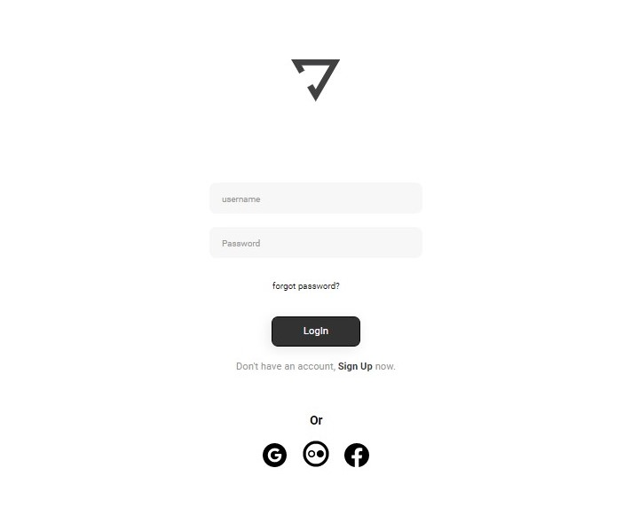
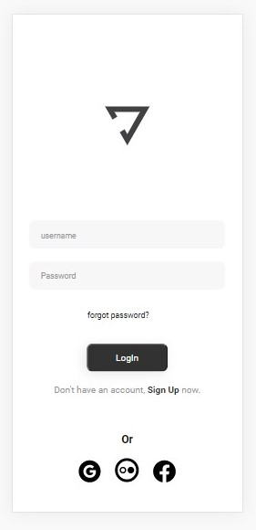

<h2>🚀 Nome do Projeto:</h2>

<h3>Yoga Interface - DevClub.</h3>

<h2>📝 Descrição do Projeto:</h2>

<h3>Interface de Login feita utilizando HTML e CSS.</h3>

 

<h2>🖥️ Linguagens Utilizadas:</h2>

 

<h2>🧰 Ajustes e melhorias:</h2>

<h4>O projeto ainda está em desenvolvimento e as próximas atualizações serão voltadas nas seguintes tarefas:</h4>

- [x] <b>Criação do HTML.</b>
- [x] <b>Criação do CSS.</b>
- [ ] <b>Criação do Javascript.</b>

 

<h2>💻 Pré-requisitos:</h2>

<h4>Apenas ter um computador ligado à Internet e uma conta no GitHub para visualizar.</h3>

 

<h2>🤝 Colaboradores</h2>

<h4>Agradeço às seguintes pessoas que contribuíram para este projeto:</h4>

<table>
  <tr>
    <td align="center">
      <a href="https://github.com/olivercaputo">
         
        
          <b>Oliver Caputo</b>
        
      </a>
    </td>
    <td align="center">
      <a href="https://www.github.com/rodolfomori" target="_blank">
         
        
          <b>Rodolfo Mori</b>
        
      </a>
    </td>
    <td align="center">
      <a href="https://www.github.com/iuricode" target="blank">
         
        
          <b>Iuri Silva</b>
        
      </a>
    </td>
  </tr>
</table>
